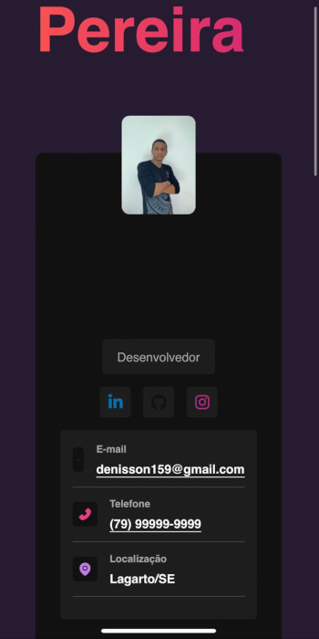
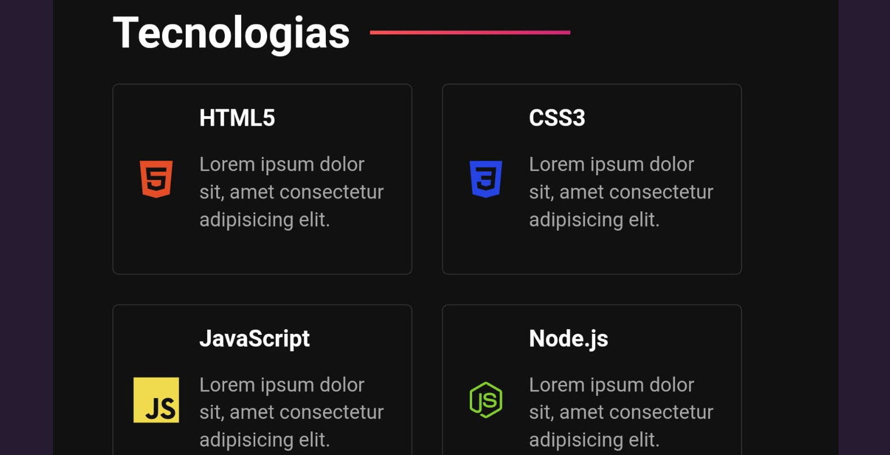

# Portfólio Denisson 
 

# Ver projeto

https://denissonpereira.github.io/port-react/

# Sobre o projeto

## Portfólio Denisson: Uma Aplicação Web com React e Sass

O **Portfólio Denisson** é uma aplicação web desenvolvida com **React** e **Sass**, construída durante uma aula do canal "Matheus Battisti - Hora de Codar". Este projeto tem como objetivo a criação de um portfólio pessoal que abrange informações sobre contatos, uma seção "Sobre mim" (About), tecnologias utilizadas e os projetos desenvolvidos.

## Layout mobile
 

## Layout mobile
 

## Layout web

# Tecnologias utilizadas
## Front end
- HTML
- CSS
- JavaScript

## Implantação em produção
- Front end web: GitHub Pages

# Como executar o projeto

[Clique aqui](https://denissonpereira.github.io/RainbowCSS/)

# Autor

Denisson Pereira Santos

https://github.com/DenissonPereira